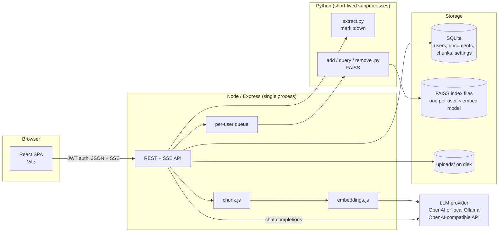
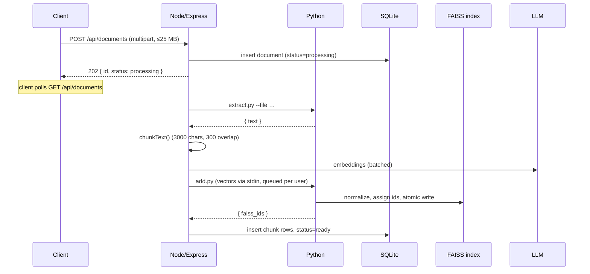
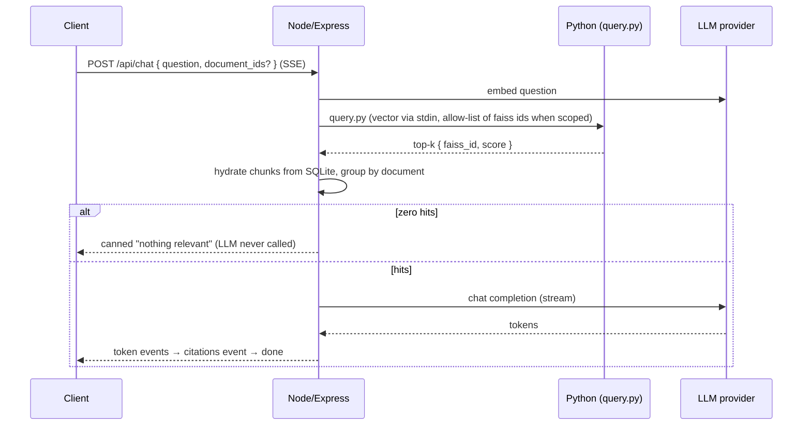

# Architecture

Chat with Docs is a RAG (retrieval-augmented generation) portal: authenticated users upload documents and ask questions that are answered **strictly** from their own collection, streamed token-by-token with citations. This doc describes how the pieces fit together; see [README.md](README.md) for requirements and the reasoning behind the key decisions.

## System overview

**Split by strength.** Node orchestrates everything — HTTP, auth, chunking, embeddings, streaming. Python does only the two jobs with no good Node equivalent: text extraction (`markitdown`) and vector search (`faiss`). Python runs as short-lived subprocesses (not a service), receiving large payloads (vectors) over stdin and answering with one line of JSON on stdout. This keeps the system one deployable unit with no second server to operate.

**Split storage by strength too.** SQLite holds users, document metadata, per-user settings, and full chunk text. FAISS index files hold only vectors + integer ids. A `chunks.faiss_id` column links the two: retrieval searches FAISS first, then hydrates the matching rows from SQLite.

## Ingest flow (upload → ready)

Ingest is **asynchronous**: the upload returns `202` immediately and the client polls. If the server dies mid-ingest, startup marks any document still `processing` as `error` (retryable via `POST /:id/retry`), so clients are never left polling forever.

## Chat flow (question → streamed answer)

- **Grounding is enforced, not just prompted**: zero retrieval hits short-circuits before any LLM call.
- **Scoping**: an optional `document_ids` array restricts retrieval to selected documents (ownership-validated; their chunks' faiss ids become an allow-list for `query.py`).
- **Citations** are per source document (best-ranked chunk decides order), emitted as a separate SSE event after the answer tokens.
- SSE over `fetch` (not `EventSource`) because `EventSource` cannot send POST bodies or auth headers.

## Storage layout

| Store | Holds | Keyed by |
|---|---|---|
| SQLite (`data/docchat.db`) | users, documents, chunk text, per-user settings | row ids |
| FAISS (`data/indexes/*.faiss` + `.meta.json`) | normalized vectors + integer ids | `(user_id, embed_model)` per file |
| Disk (`data/uploads/<user>/`) | original uploaded files | user id |

One index file per `(user, embedding model)` enforces per-user isolation and makes switching embedding models non-destructive — each model gets its own fixed-dimension index. The `.meta.json` sidecar pins an index's dimension/model and the next id counter; both index and sidecar are written via temp-file + atomic rename so a crash never leaves a torn file.

## Concurrency model

All FAISS operations for a user (add/remove/query) are serialized through an in-memory **per-user queue**: `add.py`/`remove.py` rewrite the whole index file, so two concurrent runs would race on the same on-disk snapshot and silently drop vectors. Reads share the queue because a reader holding the file open can break the writer's atomic rename on Windows. This is sufficient **only because the backend is a single Node process**; a multi-instance deployment would need a real job queue or cross-process lock.

## Provider abstraction

One OpenAI-SDK code path serves both providers — they differ only in `baseURL` / `apiKey` / model names:

| Profile | Base URL | Typical models |
|---|---|---|
| `openai` | api.openai.com | gpt-4o-mini, text-embedding-3-small |
| `local` | Ollama / llama.cpp (`:11434/v1`) | llama3.x, nomic-embed-text |

Per-user overrides (provider + model names) live in the `settings` table and are merged with profile defaults at request time.

## Security & abuse controls

- **Auth**: bare JWT bearer scheme; all document/chat/settings routes require it; auth endpoints are rate-limited per IP.
- **Prompt-injection containment is structural**: document excerpts are wrapped in `<excerpt>` delimiters that document text cannot fake or close — look-alike sequences are neutralized before interpolation and filenames are flattened to one line. The system prompt additionally declares everything inside the markers untrusted data. Covered by structural tests.
- **Cost controls**: per-user hourly token budget (chat + embeddings, 429 when exceeded) and a 25 MB per-upload cap enforced server-side.

## Frontend

React + Vite SPA, no state library. All API access goes through `frontend/src/api.js`. App shell: topbar (brand + theme switch) and a persistent sidebar (conversation history on top, navigation pinned at the bottom; slide-over on mobile). Chat history is stored client-side in `localStorage`, namespaced per user id. The neumorphic theme is pure CSS custom properties with a light/dark switch; icons are inline SVGs drawn with `currentColor` so they follow the theme automatically.
