# Requirement
- Title : Chat with Docs.
- Desc : Build a system that answers questions about content from a document collection (PDFs, text files, or any format you choose). This is the same classic RAG use-case you might be familiar with.

> **Architecture:** see [ARCHITECTURE.md](ARCHITECTURE.md) for the system overview, ingest/chat flow diagrams, storage layout, and concurrency model. **Screenshots:** [below](#screenshots).

# Assumptions : 
- You have a collection of documents that you want to query. 
- Document collection can be in any format (PDFs, text files, etc.) and can be of any size.
- Need to build a Portal where users can upload documents and ask questions about them.
- Basic Authentication is required for users to access the portal.
- The system should be able to handle multiple users and their respective document collections.

# Tech Stack :
- Frontend: React.js
- Backend: Node.js with Express.js
- SQlite for user authentication and document metadata storage
- OpenAI API for question answering and document embeddings
- Python for document processing (e.g., extracting text from PDFs) use markitdown from microsoft for pdf to text conversion
- Faiss for vector search and retrieval of relevant document sections

# Key Decisions:
- Use Python for text extraction and vector search because the best-in-class libraries for both — Microsoft's `markitdown` and `faiss` — are Python-native with no strong Node equivalent (chunking and embeddings run in Node).
- Use Faiss for vector search: `IndexFlatIP` over normalized vectors gives exact cosine search with zero tuning at MVP scale (approximate/ANN scaling is a later concern, replaced by a networked vector DB).
- One OpenAI-compatible code path for both cloud and local: OpenAI and a local Ollama/llama.cpp server differ only by base URL / API key / model name, and the provider + models are switchable per user at runtime.
- Node orchestrates; Python runs as short-lived subprocesses (not a long-running service). Node computes embeddings and hands the vectors to Python over stdin — keeps the whole thing one deployable unit.
- Separate stores by strength: SQLite holds users, metadata, and chunk text; Faiss holds only vectors + ids. A `faiss_id` links them, so retrieval searches vectors then hydrates text from SQLite.
- Index files are keyed per `(user, embedding-model)`: this enforces per-user isolation and makes switching embedding models non-destructive (each model gets its own fixed-dimension index instead of corrupting a shared one).
- Ingest is asynchronous: upload returns `202 processing` immediately and the client polls status, so large documents don't block the request.
- FAISS operations are serialized through a per-user queue: add/remove rewrite the whole index file, so two concurrent uploads would silently lose one batch of vectors (a race we reproduced before fixing). Index/meta writes are also atomic (write-to-temp + rename) so a crash never leaves a torn file. In-memory queueing is sufficient because the backend is a single process; multi-instance deployment would move this to a real job queue.
- Stream answers over SSE (not WebSockets) token-by-token, with document-level citations. Grounding is enforced — if retrieval finds nothing relevant, the LLM is never called.
- No RAG framework (no LangChain/LlamaIndex): the pipeline (chunk → embed → search → prompt → stream) is a few dozen lines of explicit, debuggable code.

# Guardrails
- Only document related questions should be answered, and the system should not provide any unrelated information.
- If outside the scope of the document collection, the system should respond with a message indicating that it cannot answer the question.
- Prompt injection from uploaded documents is mitigated (not eliminated — no prompt-level defense is): excerpts are wrapped in delimiters the document text cannot fake or close (delimiter look-alikes are neutralized, filenames flattened to one line), and the system prompt declares everything inside them untrusted data whose embedded instructions must be ignored. Containment is covered by structural tests.
- Abuse & cost controls: login/signup are rate-limited per IP, and each user has an hourly LLM + embedding token budget (configurable; enforced before any provider call with a 429). Documents are capped at 25 MB per upload, enforced server-side and surfaced in the UI.

# Screenshots

| | Light | Dark |
|---|---|---|
| **Sign in / sign up** |  | 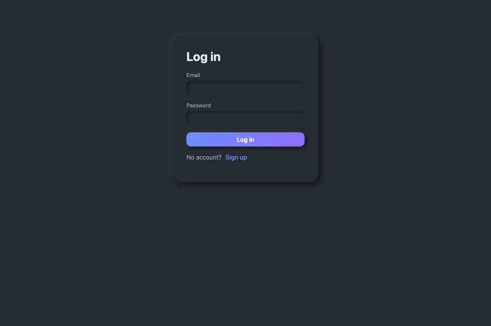 |
| **Documents** | 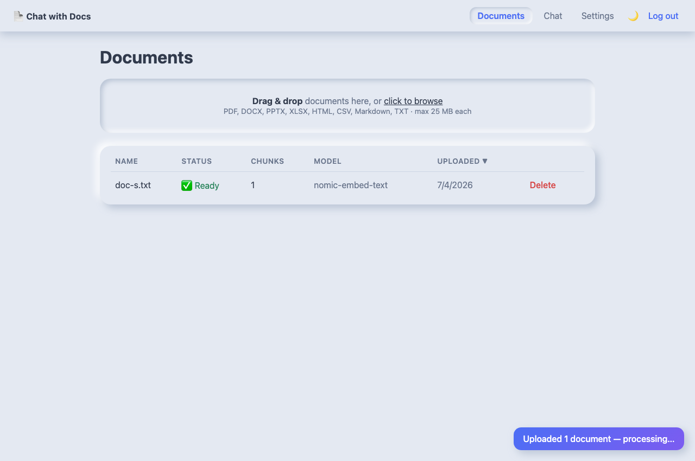 | 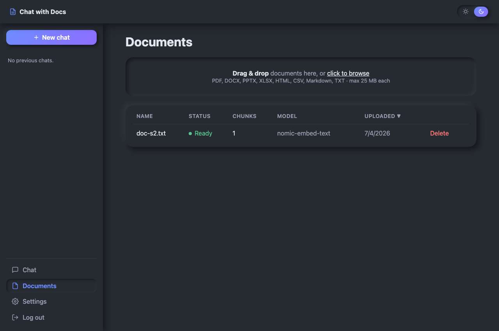 |
| **Chat — empty state** | 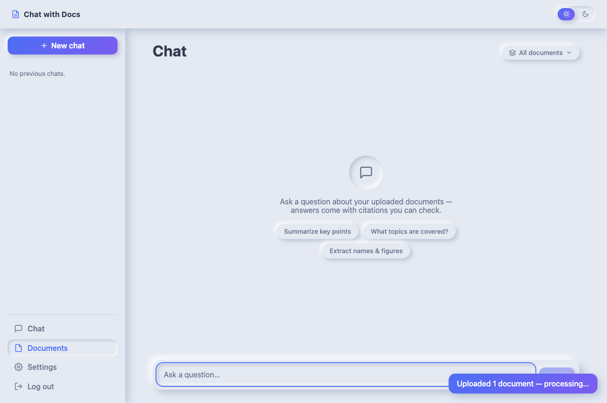 | 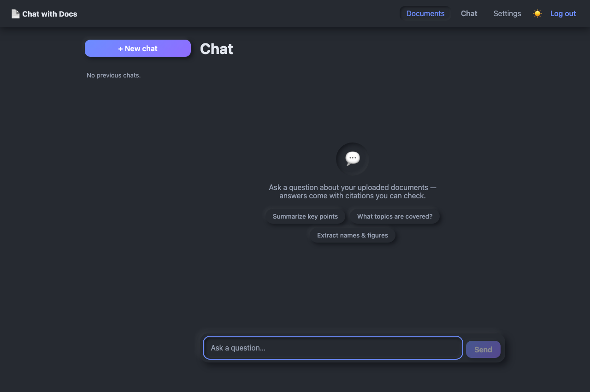 |
| **Chat — answer with citations** | 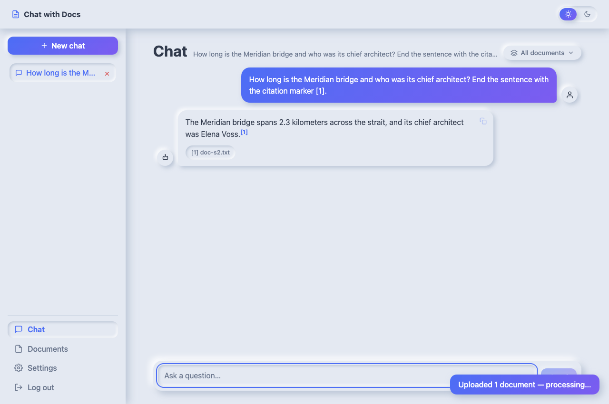 | 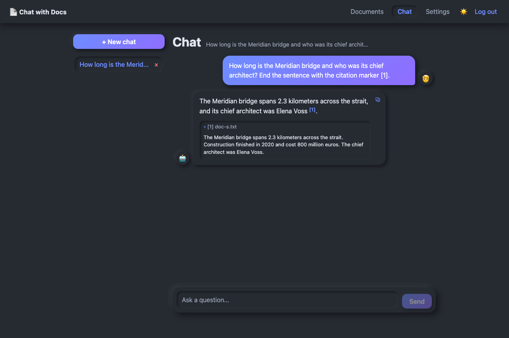 |
| **Settings** | 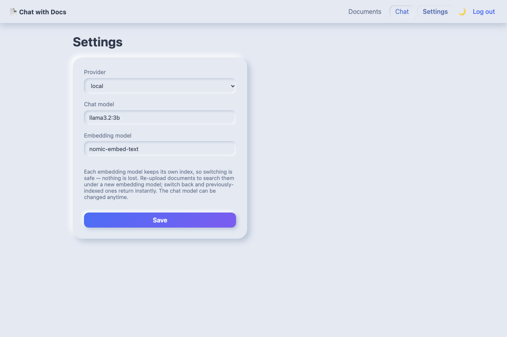 | 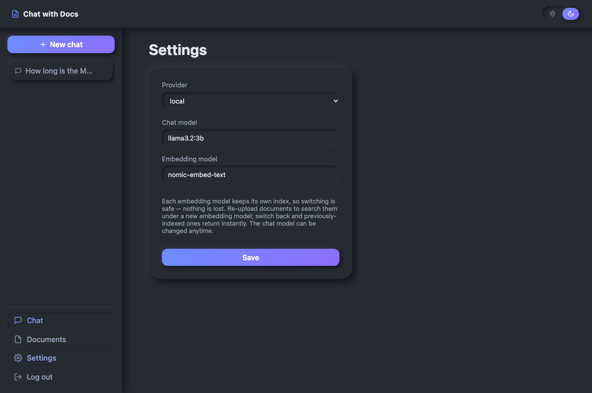 |
| **Mobile chat** | 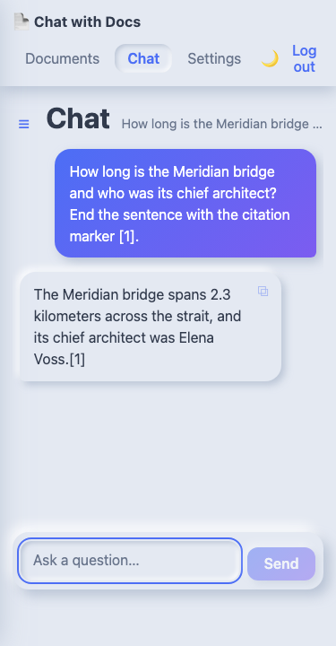 | 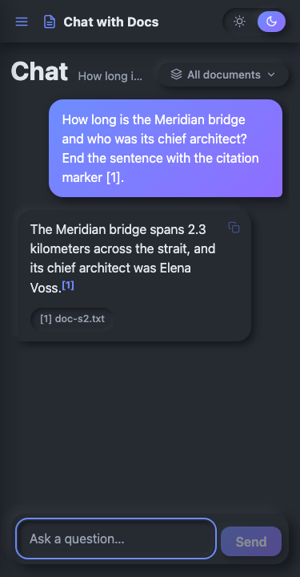 |

# Future Enhancements:
- Remove the 25 MB per-document limit: streaming ingestion for arbitrarily large files (embedding already runs in batches; extraction and FAISS writes would need to stream/append instead of loading whole documents)
- Implement advanced search features (e.g., keyword search, filtering by document type)
- Migrate to a more robust database system (e.g., PostgreSQL, MongoDB) for better scalability and performance
- Persistent chats allowing users to save and revisit previous conversations instead of local browser storage
- Instead of HTTP Polling for document status, implement WebSockets for real-time communication between the frontend and backend
- Add support for other LLM providers (e.g., Anthropic, Gemini,...) to give users more options for question answering and document embeddings
- Retrieval quality evaluation: a small gold dataset (questions mapped to the documents that answer them) plus a harness reporting hit-rate@k / MRR / citation correctness, so chunking or embedding changes can be measured instead of guessed. A score threshold (relevance floor) would then be tuned from that data to drop weak matches instead of always returning top-k.

# Scaling
- Instead of local and openai minimal models for production we can go with AWS bedrock for inference and Automated ECS scaling tasks for servers
- UI can be hosted with S3 + Cloudfront with Edge Server Caching
- Replace with Aurora Mysql and Vector DB for production scale application instead of sqlite and faiss
- Introduce Queues Pub/Sub for document status and chat completions

# Usage of AI Tools
- Defined deliverables in Readme and built increamentally with that as a initial requirement.
- Most of the code is written with Claude Code with step by step instruction 
- Provided claude.md with hand written instructions and rebuild entirely with claude code for better formatting
- Every generated code is verified manually and application flow is tested for each iteration

# Engineering Standards followed
- Backend end-to-end tests before Integration
- Structured logging
- Containerization for backend and frontend
- basic prompt injection tests
- OpenApi Documentation for API testing

# Engineering Standards excluded
- CI/CD pipelines - can be build easily once infrastructure is finalized
- Frontend tests - verified the flow with playwright for now using claude code
- Have not opted for complex react implementations, followed basic code splitting
- Typescript implementation for frontend and backend

# Setup Instructions
- [Frontend](./frontend/setup.md)
- [Backend Node](./backend/setup.md)
- [Backend Python](./backend/python/setup.md) 

